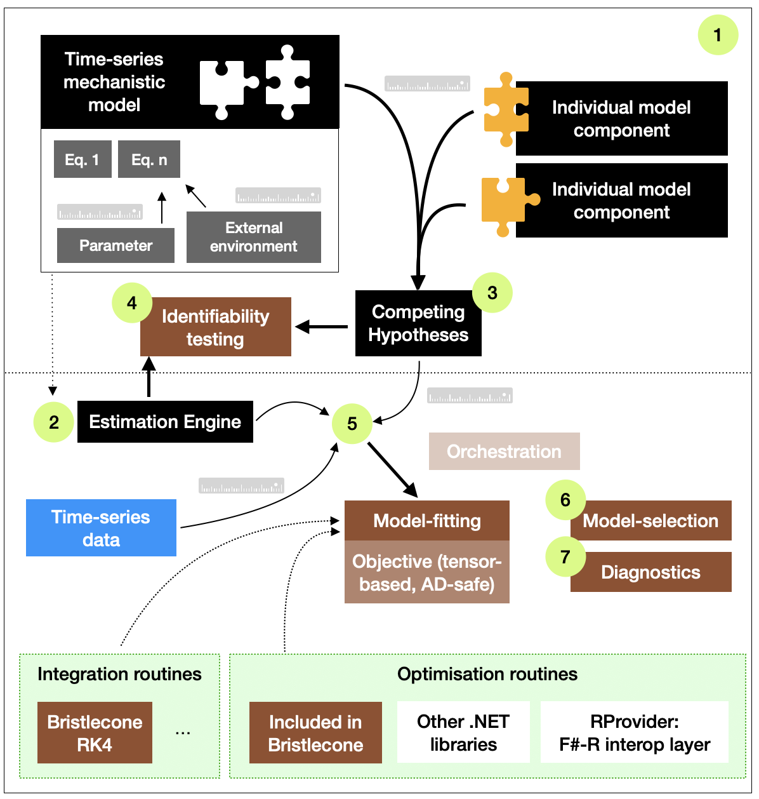

# Summary

Long-term ecology (LTE) seeks to extend our understanding of ecological systems to decades to centuries, beyond the observational period. LTE researchers employ environmental proxies (e.g., microfossils, wood rings) to reconstruct variability in biodiversity and environments over decades to centuries. Disparate dating methods (e.g., radiocarbon dating) and representations of time are thus usually required for interpretation. Although the long view is integral to comprehensively understand ecosystem responses to environmental change, there has historically been limited application of causal inference within LTE [@Willis_Araújo_Bennett_Figueroa-Rangel_Froyd_Myers_2007].

Mechanistic modelling approaches may be used to infer the form and strength of ecological processes. In *The Ecological Detective*, @Hilborn_Mangel_1997 present a toolkit for confronting ecological models with data. Here, I developed a modelling framework to enable LTE researchers to apply the ecological detective approach to proxy time-series for causal inference. Key capabilities include: a human-readable Domain Specific Language (DSL) for model definition with enforced dimensional correctness; model composition and scaffolding competing hypotheses; and confrontation of models with time-series of disparate dating methods.

# Statement of need

## Research purpose

*Bristlecone*'s purpose is to enable researchers to build causal knowledge of the role of ecological mechanisms over decades to centuries, through confrontation of models with proxy data. LTE is essential in predicting biodiversity responses to climate change, as we may (indirectly) observe (a) ecological processes that operate over longer timescales (e.g., soil development [@McLauchlan_Gerhart_2017]); (b) biodiversity responses to broader environmental envelopes; and (c) ecological stable states and resilience [@Willis_Bailey_Bhagwat_Birks_2010]. Although LTE research has often been descriptive, causal understandings are essential for establishing predictive capability. Causal understanding may be achieved through combining multiple lines of evidence, including (a) experimentation, (b) identifying spatial-temporal associations in observational data, and (c) mechanistic investigation. Without experimental approaches in LTE, surrogates such as space-for-time substitution can misrepresent the rate and order of processes [@Elmendorf_Henry_2015]; thus, mechanistic investigation is essential.

In contemporary ecology (‘*neo-ecology*’), the 'ecological detective' is an approach for causal inference [@Hilborn_Mangel_1997]. The approach requires: (1) examining theory to understand plausible mechanisms; (2) understanding process and observation uncertainties; and (3) confronting plausible alternatives with data. Taking causal mechanisms as processes *"along which a signal can be propagated to produce a response"* (@Grace_HuntingtonKlein_2025, p5), the ecological detective approach may be applied to infer causal mechanisms using LTE time-series.

*Bristlecone* is a toolkit that enables LTE researchers to utilise the ecological detective approach through: (1) a human-readable, succinct declarative grammar for the ‘ecological detective’ workflow; and (2) implementations of key components required to use the grammar. The toolkit includes a grammar of time that reflects the dating methods used within LTE and neo-ecology; it thus targets neo-ecologists who would like to integrate neo-ecological and LTE time-series for multi-scale analysis.

*Bristlecone* occupies a distinct niche: although tools exist for data wrangling and inference, *Bristlecone* is a higher-level grammatical layer focused on correctness in model construction from an ecological perspective. General-purpose inference engines (e.g., Stan [@carpenter2017stan; @Stan-Development-Team_2025], JAGS [@plummer2003jags]) do not support dimensional correctness and hold limited built-in temporal concepts. *Bristlecone* embeds units-of-measure within a DSL: ecological states and flows, error structures, and temporal resolutions are expressed as explicit ecological semantics. The DSL enforces not only dimensional consistency but also ecological model structure, for example: rates must be expressed over time; likelihoods correspond to the correct ecological state; and temporal resolutions match between solvers and models. Stocks / flows, parameters, processes, and environmental forcings must thus be expressed in ecological terms. *Bristlecone* thus formalises the ecological detective workflow using ecological semantics.

## State of the field

R is the favoured language of ecologists, increasing in prevalence within high-impact journals from 10.9% in 2013 to 66.9% in 2023 [@Gao_2025]. Within LTE, key statistical approaches include transfer functions, generalised additive models, and canonical correspondence analyses. Proxy-specific mechanistic approaches have also been applied; the landscape models REVEALS [@Sugita_2007] and LOVE [@Sugita_2007_2] simulate taxon-specific biomass from pollen fluxes. However, mechanistic inference from LTE time-series has been limited (e.g., @Jeffers_Bonsall_Watson_Willis_2011). In dendrochronology, (semi-)mechanistic approaches are more prevalent, such as inferring temperature/moisture limits to tree growth using VS-Lite [@TolwinskiWard_2011].

*Bristlecone*'s two unique contributions are: (1) integrating the ecological detective workflow within a single conceptual framework; and (2) providing ecological clarity through dimensional correctness. *Bristlecone* utilises F#’s type system and expressiveness [@Syme_2020] to enforce dimensionally-consistent ecological models and promote human readablity, improving transparency and reproducibility of supplementary material. As the core design relies on F# language features that could not be replicated within R, *Bristlecone* was designed from scratch. However, a compositional approach was sought whereby components may be substituted where beneficial alternatives exist (e.g. optimisers). The F# R type provider [@rprovider_contributors_2026_21964392] presents an avenue for embedding R libraries and graphics via typed R access.

*Bristlecone*’s target audience is long-term- and neo-ecologists who wish to explore mechanistic modelling. The library aims to reduce computational knowledge required to utilise the ecological detective approach within LTE research.

## Software design

Although F# is uncommon in ecological research, I considered that an F#-based domain-specific language could be intuitive for ecologists with R experience. I sought to include the seven stages of the ‘ecological detective’ workflow: (1) definition of time-series models; (2) specifying model-fitting methods ("estimation engines"); (3) composition of alternative model hypotheses; (4) identifiability testing; (5) model-fitting; (6) model-selection; and (7) diagnostics.


*Figure 1 Conceptual framework. Green circles indicate stage of analysis. Box colours: brown = Bristlecone core functions; black = user-defined elements using the Domain Specific Language; blue = user-supplied data; white = external functions.*

A core requirement was that ecological models should utilise F# type safety and units of measure such that all models, their composition, and methods are dimensionally consistent. I designed a DSL that ensures dimensional consistency across equations, parameters, external forcings (e.g., climate), and methodological approaches, supporting the scientific process by raising errors during compile-time prototyping.

To demonstrate, fish stocks (see: *The Ecological Detective*, Chapter 10) may be represented in discrete-time by:

```fsharp
module Schaefer =

    let B = state<kton> "biomass"
    let I = measure<1> "CPUE" // Catch per unit effort
    let C = environment<kton> "catch"

    let r = parameter "r" Positive 0.01</year> 1.0</year> // Intrinsic growth rate
    let K = parameter "K" Positive 100.<kton> 2000.<kton> // Carrying capacity
    let q = parameter "q" Positive 1e-6<1/kton> 1e-2<1/kton> // Catchability
    let B0 = P K

    let dt = Constant 1.<year>
    let ``B_est[t+1]`` =
        let n = State B + P r * State B * (Constant 1. - State B / P K)
          * dt - Environment C
        Conditional (n .> Constant 0.<kton>) n (Constant 0.<kton>)

    let It = P q * State B

    let sigma = parameter "sigma_v" NoConstraints 0.01 1.0
    let NLL = ModelLibrary.NegLogLikelihood.LogNormal (Require.measure I) sigma

    let model =
        Model.discrete<year>
        |> Model.addDiscreteEquation B ``B_est[t+1]``
        |> Model.addMeasure I It
        |> Model.initialiseHiddenStateWith B B0
        |> Model.estimateParameter r
        |> Model.estimateParameter K
        |> Model.estimateParameter q
        |> Model.useLikelihoodFunction NLL
        |> Model.compile
```

Here, 'catch per unit effort' must be dimensionless as required by lognormal observation error, and ``B_est[t+1]`` must result in `kton`. If the model was continuous-time, `B` would equal ``kton/year``. The entire model pipeline is unit-aware, preventing many model definition errors at compile-time. To compose alternative mechanisms, I designed a pipe-based workflow that turns nested model systems into a set of hypotheses while ensuring dimensional consistency between sub-components:

```fsharp
let hypotheses =
    ``base model``
    |> Hypotheses.createFromModel
    |> Hypotheses.apply ``geometric constraint``
    |> Hypotheses.apply ``plant-soil feedback``
    |> Hypotheses.apply ``temperature limitation to growth``
    |> Hypotheses.apply ``N-limitation to growth``
    |> Hypotheses.compile
```

I designed Bristlecone's *estimation engine* so that models and data may be combined across time concepts, with engines ensuring temporal consistency at compile-time. Radiocarbon, contemporary calendar, and AD/BC time-series may all be applied or combined with models of various temporal resolutions; the only requirement is that appropriate conversions are configured within the engine. The strength and importance of mechanisms over different timescales (e.g., observational- versus centennial-time) may thus be investigated by combining ecological models with different (proxy) data sources.

Identifiability testing (assessing if the engine and model can infer known parameters) is essential for valid inference. I designed a unit-safe pipeline-based testing suite where synthetic time-series can be generated and applied to test identifiability of model-engine combinations. For model-fitting, I included orchestration for multi-threaded fitting. For model-selection I included Akaike weights, as *Bristlecone* currently focuses on information theoretic approaches. Finally, goodness-of-fit (root mean square error and n-step predictions) and other diagnostics were included. Resultant parameter estimates are unit-typed so unit consistency is carried to further analysis outside *Bristlecone*.

### Integration with other libraries

I designed *Bristlecone* as a high-level workflow; it is thus extensible such that underlying components, such as integration and optimisation routines, may be substituted. I chose to enable gradient-based approaches by integrating automatic differentiation using DiffSharp tensors [@baydin2015diffsharpautomaticdifferentiationlibrary].

Three classes of optimisation routines broadly suited to ecological time-series were included, while recognising that more appropriate alternatives for specific problems may be substituted. First, amoeba-based methods have been applied to palaeoecological inference [@Jeffers_Bonsall_Watson_Willis_2011] but are best suited to simpler likelihood surfaces. Second, I included Classical and Fast Simulated Annealing [@Lee_2015; @Szu_Hartley_1987]. Fast Simulated Annealing is more performant at identifying global minima; *Bristlecone*'s implementation was previously applied in dendroecology [@Martin_MaciasFauria_Bonsall_Forbes_Zetterberg_Jeffers_2021]. Third, I included Monte Carlo methods including Filzbach, a meta-heuristic specific to high-dimensional ecological models [@Purves_2016]. As the existing Filzbach library is unmaintained, and F# math libraries lack annealing, I implemented both within *Bristlecone*.

## Research impact statement

*Bristlecone* has been developed openly since 2018, maturing through research requirements. It has been formatted for community use and contribution, including documentation, examples, a benchmark suite, and contributor guidelines. Previous research applied multi-proxy palaeoecological data to infer the role of soil nutrients in plant productivity through the Holocene [@Jeffers_Bonsall_Watson_Willis_2011]. Their models and optimisation routine were written from-scratch in verbose C; I reproduced their analysis as a more accessible *Bristlecone* example.

*Bristlecone* was integral to @martin2019a and @Martin_MaciasFauria_Bonsall_Forbes_Zetterberg_Jeffers_2021, where it was applied to determine the role of soil nutrients in controlling Arctic shrub growth (*Bristlecone* v1). Alternative hypotheses of nutrient limitation were confronted with wood ring and nitrogen isotope time-series. That analysis is included as an example, formatted for *Bristlecone* v3. *Bristlecone* is currently being applied to a pan-Arctic synthesis of Arctic palaeoecological records [@Martin_Bell_Blake_Bradshaw_Kuoppamaa_Pavey_Prendin_Speight_Villar_Macias-Fauria_2024].

## AI usage disclosure

AI has not been used to write this manuscript.

No AI tools were used prior to August 2025. From then, the Microsoft Copilot macOS app was used as an external tool to the development environment to suggest missing tests, refactoring to code snippets, and potential approaches to proposed v3.0/3.1 features. Code suggestions were critically examined and if beneficial implemented manually with human oversight. In some cases, AI code suggestions were pasted into the development environment as a starting point and then manually adapted. No agents have been used.

## Acknowledgements

I thank support from Dr Elizabeth Jeffers and Prof Marc Macias-Fauria.

## References
